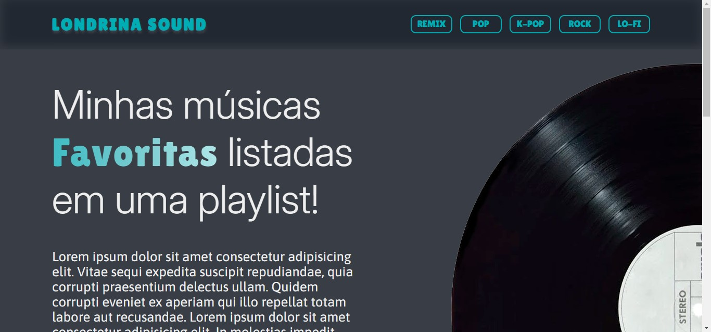
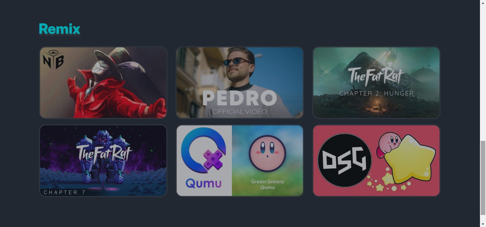

# Londrina Sound

## Bem-vindo! 👋
Obrigado por ver meu projeto!

## Badges

## Descrição do projeto 😀
Este projeto aborda sobre o Londrina Sound, uma playlist personalizada, feito com a ajuda da plataforma Alura e do professor Bruno Tadeu.

## Como os usuários podem utilizá-lo?
Neste site, podemos encontrar diversas músicas, organizadas pelas categorias:
* Remix
* Pop
* K-Pop
* Rock
* Lo-Fi

## Tem algum feedback? 😁
Adoro receber feedbacks! Estou sempre buscando melhorar meus projetos. Então, se você tiver algo que gostaria de mencionar, envie um e-mail para evex12324@gmail.com!

## Tecnologias utilizadas
Foi utilizado no projeto o uso de:
* License
* Display
* Links
* Imagens

## Contribuidores
Alura, Vercel e Professor Bruno Tadeu

## Autor do projeto.
Pedro de Carvalho

**Compartilhe este repositório!** 🚀
